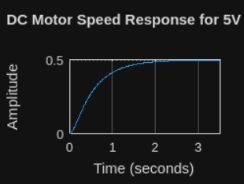

# DC-motor-modeling-matlab
Modeling and analysis of a DC motor using MATLAB and Simulink
# DC Motor Modeling and Analysis using MATLAB

## Objective
To model and analyze a DC motor as an electromechanical system using MATLAB and Simulink.
## MATLAB Implementation

The DC motor mathematical model was implemented in MATLAB using transfer function and state-space approaches.

Main script:
- `dc_motor_model.m`

Simulink model:
- `dc_motor_simulink.slx`
  
## Tools Used
- MATLAB
- Simulink

## Project Contents
- MATLAB script for transfer function and time-domain analysis
- Simulink model implementing electrical and mechanical equations
- Step response and surface plots

## Key Results
- Speed response for step voltage input
- Effect of input voltage on motor speed
- Performance metrics such as rise time and settling time

## How to Run
1. Open dc_motor_model.m in MATLAB
2. Run the script to generate plots
3. Open dc_motor_simulink.slx and simulate the model

## Author
Ruchir Tambe
